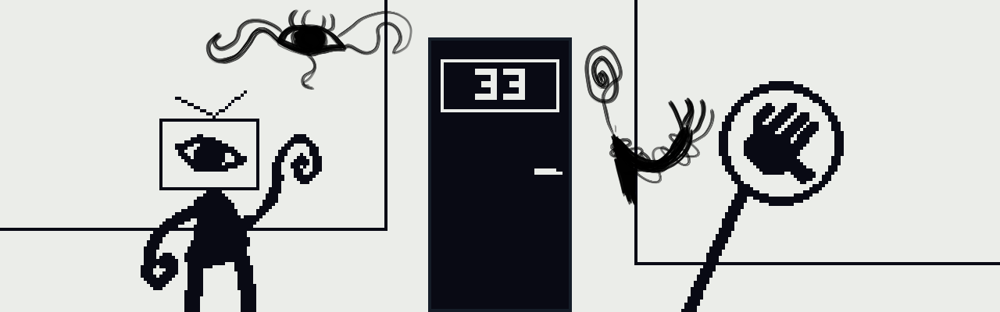

# 🕹️ SALA 33


Ambiente multiplayer em tempo real desenvolvido como projeto da disciplina de **Sistemas Distribuídos**. Inspirado em RPGs retrô e mundos virtuais como o Club Penguin, o projeto simula um pequeno mundo com salas interconectadas, chat, personagens e minigames — tudo sincronizado via WebSockets.

O projeto é **open-source** e foi construído para ser fácil de expandir: qualquer pessoa pode criar novas salas, personagens, músicas e mecânicas sem tocar no engine principal.

> 📖 Quer contribuir? Leia o **[MODDING.md](./MODDING.md)**.

---

## 🌐 Funcionalidades

### Mundo e Navegação
- 12 salas interconectadas com transição suave (fade) entre elas
- Cada sala tem fundo (imagem **ou vídeo animado**), trilha sonora e conexões próprias
- Spawn definido por sala de destino

### Multiplayer em Tempo Real
- Movimento sincronizado de todos os jogadores na sala
- Entrada e saída de jogadores notificada para todos
- Somente jogadores da mesma sala trocam eventos entre si

### Contas e Social *(opcional — requer Postgres)*
- Cadastro/login com JWT caseiro, hashing PBKDF2 e anti-brute-force
- Reset de senha por e-mail (Brevo)
- Amigos (pedidos, aceitar/recusar), teleporte para amigo, mensagens privadas
- Salas favoritas e likes por sala
- **Modo convidado** funciona sem banco nenhum

### Personagens
- 12 skins (sprites 32×32 pixel art, paleta noir em tons de cinza)
- Animação de bobeio ao se mover e espelhamento automático por direção

### Chat
- Mensagens em tempo real com balões de fala sobre os personagens
- Indicador de digitação (`...`) e emotes via botões ou atalhos (`:)`, `:(`, `<3`…)

### Áudio
- Trilha sonora por sala com lazy loading (só baixa ao entrar na sala)
- Streaming de áudio com suporte a HTTP Range (música grande não trava)

### Mobile / PWA
- Instalável como app (manifest + service worker / Workbox)
- Controles touch (d-pad + botão de interação)

### Minigames
- 🏓 **Pong Multiplayer** — física da bola rodando no servidor a 60fps
- 🔥 **Duelo de Aura** — quem aperta espaço mais rápido; partículas e screen shake
- ♟️ **Xadrez** — regras completas (xeque-mate, roque, en passant, promoção), lobby de
  partidas, timer 5/10/30, relógios no servidor e **ranking Elo**
- 👾 **Raid** — evento de sala

---

## 🗺️ Salas Disponíveis

| Sala | Descrição |
|---|---|
| 🏠 The Hub | Área central, conecta as outras |
| 🎮 Sala de Jogos | Mesa de Pong multiplayer |
| ♟️ Xadrez | Partidas de xadrez com lobby e ranking |
| 🖼️ Museu | Galeria de arte interativa |
| 🌲 Floresta | Sala ambiente |
| 🛏️ O Quarto | Duelo de Aura via TV |
| 📺 Televisão · 👾 Raid · 🐟 Aquário · 💭 Sonhos 1-3 | Salas temáticas / eventos |

---

## 🚀 Como Executar

> O cliente agora é buildado com **Vite**. O backend continua sendo Python puro.

### Pré-requisitos

```bash
pip install -r requirements.txt   # backend (websockets; asyncpg é opcional)
npm install                       # frontend (Vite) — só na primeira vez
```

### Opção A — Desenvolvimento (hot reload do cliente)

```bash
npm run dev        # Vite na :5173  (terminal 1)
python server.py   # WebSocket na :8080  (terminal 2)
```
Abra **http://localhost:5173**.

### Opção B — Produção local (serve o build)

```bash
npm run build      # gera o dist/
python server.py   # serve o dist/ na :8000 + WebSocket na :8080
```
Abra **http://localhost:8000**.

> Sem `DATABASE_URL` o jogo roda normalmente em **modo convidado** (sem contas/amigos).
> Ao iniciar, o servidor exibe as salas registradas e as portas HTTP/WS.

### Acessar de outros dispositivos (LAN)

O servidor imprime o IP local no boot. Abra em qualquer dispositivo da mesma rede:

```
http://SEU_IP_LOCAL:8000
```

| Serviço | Porta (dev / prod) |
|---|---|
| Vite (frontend, modo dev) | 5173 |
| HTTP (frontend, modo build) | 8000 |
| WebSocket (multiplayer) | 8080 |

---

## 🎮 Controles

| Ação | Tecla |
|---|---|
| Mover | WASD ou Setas |
| Interagir | E |
| Chat | Enter |
| Confirmar / mover peça (xadrez) | E ou Espaço |
| Sair de interação / minigame | Q |
| Duelo de Aura (spam) | Espaço |
| Volume | F1 |
| Debug (hitboxes e grid) | F2 |

---

## 🏗️ Arquitetura

### Visão Geral

O servidor é **autoritativo**: todo estado global (posições, pontuações, minigames) vive nele. O cliente é responsável apenas por renderizar e enviar inputs.

```
Cliente (browser)                    Servidor (Python)
─────────────────                    ─────────────────
index.html + src/ (ES Modules)       server.py
  buildado com Vite → dist/                │
      │                                    │
      │   WebSocket JSON messages          │
      │ ◄─────────────────────────────►   │
      │                                    │
  Canvas 2D                         asyncio + websockets
  Plugin system (mods)              ThreadingTCPServer (HTTP)
  Lazy audio · PWA                  server_mods/*.py (mecânicas)
                                    Postgres (asyncpg, opcional)
```

### Protocolo de Mensagens

Todas as mensagens são JSON com um campo `"tipo"`. Exemplos:

| `tipo` | Direção | Descrição |
|---|---|---|
| `login` | cliente → servidor | Autentica e entra na sala inicial |
| `mover` | cliente → servidor | Atualiza posição |
| `mudar_sala` | cliente → servidor | Troca de sala via porta |
| `chat` | bidirecional | Mensagem de texto |
| `novo_jogador` | servidor → cliente | Notifica entrada de jogador |
| `movimento` | servidor → cliente | Broadcast de posição |
| `jogador_saiu` | servidor → cliente | Notifica saída |
| `atualizacao_pong` | servidor → cliente | Estado do Pong a 60fps |
| `atualizacao_aura` | servidor → cliente | Estado do Duelo de Aura |
| `xadrez_lobby` / `xadrez_estado` | servidor → cliente | Lobby/ranking e estado da partida de xadrez |

### Estrutura de Arquivos

```
Sala33/
├── server.py                    ← engine do servidor
├── server_mods/                 ← mecânicas server-side por sala
│   ├── sala_jogos.py            (Pong)
│   ├── o_quarto.py              (Duelo de Aura)
│   ├── raid.py                  (Raid)
│   └── xadrez.py                (Xadrez + ranking Elo)
├── index.html                   ← entrada do Vite (raiz)
├── vite.config.js · package.json
├── src/                         ← engine do CLIENTE (ES Modules, buildado p/ dist/)
│   ├── main.js                  ← loop, estado, input, render
│   └── net/ audio/ render/ ui/ world/ core/
├── dist/                        ← saída do build (gerado, gitignored)
└── public/                      ← servido verbatim (copiado pro dist/ no build)
    ├── assets/                  ← maps (imagem/vídeo), characters, music, artworks
    └── mods/                    ← ✦ conteúdo moddável ✦
        ├── manifest.json        ← lista o que carregar
        ├── personagens.json     ← roster de personagens
        ├── salas/               ← um JSON por sala
        └── logicas/             ← plugins JS client-side por sala
```

### Sistema de Mods

O jogo carrega toda a configuração do mundo de `public/mods/` dinamicamente. Os plugins
em `public/mods/logicas/*.js` ficam no `publicDir` do Vite — são copiados **sem bundlar**
e carregados em runtime, então o sistema de mods continua aberto mesmo com o build. O
servidor descobre mecânicas novas em `server_mods/` automaticamente ao iniciar.

**Adicionar uma sala nova** não exige tocar no engine (`src/` ou `server.py`) — só criar
um JSON, colocar os assets nas pastas certas e registrar no `manifest.json`. O passo a
passo completo, a API dos plugins e a **ordem de renderização** (`renderFundo` vs
`render`) estão no **[MODDING.md](./MODDING.md)**.

---

## 🧩 Contribuindo

O projeto foi pensado para que qualquer pessoa possa criar conteúdo novo sem precisar entender o engine. O fluxo mínimo pra uma sala nova:

1. Coloque a imagem em `public/assets/maps/`
2. Crie `public/mods/salas/minha_sala.json`
3. Adicione o ID em `public/mods/manifest.json`

Para mecânicas interativas (minigames, puzzles, NPCs), veja o **[MODDING.md](./MODDING.md)** — tem a API completa dos plugins com exemplos.

---

## 📚 Conceitos de Sistemas Distribuídos Aplicados

| Conceito | Implementação |
|---|---|
| Comunicação persistente | WebSockets (conexão contínua, sem polling) |
| Protocolo de mensagens | JSON tipado com campo `tipo` |
| Estado autoritativo | Servidor é a única fonte da verdade |
| Broadcast seletivo | Eventos propagados apenas para jogadores da mesma sala |
| Concorrência | `asyncio` com fila de mensagens por conexão (`asyncio.Queue`) |
| Separação de responsabilidades | HTTP (estático) e WS (tempo real) em portas diferentes |
| Lazy loading | Áudio só carregado ao entrar na sala |
| Modularidade | Mecânicas isoladas em módulos Python e plugins JS |

---

## 🛠️ Stack

**Backend:** Python 3 · asyncio · websockets · http.server / ThreadingTCPServer · asyncpg (Postgres, opcional)

**Frontend:** HTML5 · CSS3 · JavaScript (ES Modules) · Canvas 2D API · **Vite** · PWA (vite-plugin-pwa / Workbox)

**Deploy:** Railway (Nixpacks builda o frontend; `server.py` serve o `dist/`)
